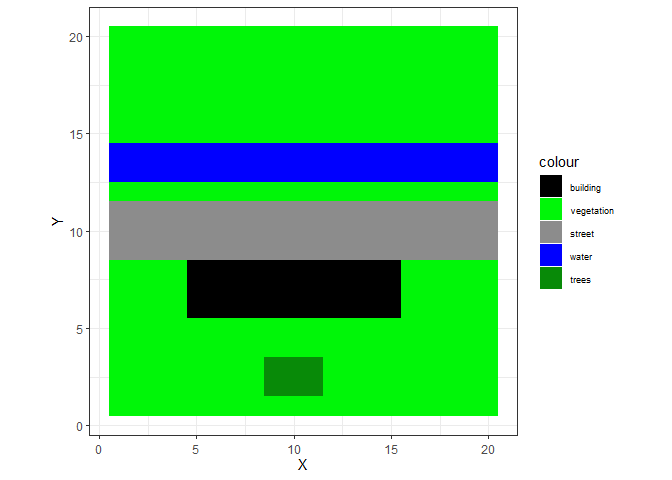

rPALM
=====

<!-- badges: start -->
<!-- badges: end -->
rPALM provides R6 classes to create and edit static drivers for the
urban climate model PALM-4U.

Installation
------------

Right now, rPALM is only available via [GitHub](https://github.com/):

    # install.packages("devtools")
    devtools::install_github("SebaStad/rPALM")

Example
-------

A simple example to create a static driver from scratch. Lots of
information about what and why is yet missing!

    library(rPALM)
    # First:
    # Define a headclass
    manual_headclass <- palm_global$new(title = "GIT Example",
                                        author = "sest",
                                        institute = "IBP",
                                        location = "Hoki",
                                        x0 = 0,   # only important for visualization on a map later on
                                        y0 = 0,   # only important for visualization on a map later on
                                        z0 = 0,
                                        t0 = "2018-06-21 12:00:00 +00", # Character with Date in this format, 
                                        # might be important to have correct in later releases of PALM!
                                        lat = 52.502302,   # important for solar radiation
                                        lon = 13.364862,   # important for solar radiation
                                        dx = 5)

    manual_class <- palm_ncdf_manual$new(nx = 20, ny = 20, dx = 5,
                                         headclass = manual_headclass)

    # Manually set vegetation to short grass
    manual_class$data$vegetation_type$vals <- array(3,dim = c(20,20))
    # Set one Tree
    manual_class$data$vegetation_type$vals[9:11,2:3] <- 6

    # Pavement
    manual_class$data$pavement_type$vals[,9:11] <- 2

    # water 
    manual_class$data$water_type$vals[,13:14] <- 2

    # buildings
    manual_class$data$buildings_2d$vals[5:15, 6:8] <- 20
    manual_class$data$building_id$vals[5:15, 6:8]  <- 1
    manual_class$data$building_type$vals[5:15, 6:8] <- 3

    #Sort Data
    manual_class$SortOverlayingdata("BPWV")

    # plot
    manual_class$plot_area(1,1,20,20)

While basically all data is now available, some cleanup functions have
to be called to create the static driver:

    # First, create the 3D Buidlings data. It does not do anything different from buildings_2d BUT:
    #       1. enables 3D visualization in ParaView (so it is mandatory)
    #       2. enables the creation of bridges and gates (has to be done manually, time expensive)
    manual_class$createbuilding3D(TRUE, FALSE)

    # Second, create soil and surface fraction
    # Both are mandatory for the simulation
    manual_class$addsoilandsurfacefraction(type_soil = 2)

    # Third generate LAD
    manual_class$generate_lai_array(dz = 5, fixed_tree_height = 15)
    # That function has a lot of variables, but these are enough. dz is mandatory

    # Fourth, set water temperature to 288K
    # Create "water_pars" data 
    manual_class$add_lod2_variable("water")
    manual_class$data$water_pars$vals[,,1][manual_class$data$water_type$vals>=0] <- 288

    # Further functions, that can be useful, but are not needed in this example:

    # manual_class$downscale_resolution(factor = 2)
    # downscales the resolution by a factor of 2, i.e. from 5 to 10 m

    # manual_class$quickplot("vegetation_type")
    # allows a quick look at 2D data in the class

    # manual_class$savedplots[[1]]
    # All plot calls with $plot_area are saved in the list $savedplots

    # Count of plots can be called via 
    # manual_class$plotcntr

    # Finally: set an eportname of the file
    manual_class$exportname <- "quicktest.nc"

    manual_class

    ## PALM Class 
    ## Gridpoints in x:20
    ## Gridpoints in y:20
    ## Resolution:5
    ## Available data: 
    ## zt
    ## buildings_2d
    ## building_id
    ## building_type
    ## vegetation_type
    ## water_type
    ## pavement_type
    ## buildings_3d
    ## soil_type
    ## surface_fraction
    ## lad
    ## water_pars

    # manual_class$exportncdf()
    # Exports the static driver in the current work directory

Data
----

Data and Dimensions are hold in seperate lists

    names(manual_class$data)

    ##  [1] "zt"               "buildings_2d"     "building_id"     
    ##  [4] "building_type"    "vegetation_type"  "water_type"      
    ##  [7] "pavement_type"    "buildings_3d"     "soil_type"       
    ## [10] "surface_fraction" "lad"              "water_pars"

    names(manual_class$dims)

    ## [1] "x"                 "y"                 "z"                
    ## [4] "nsurface_fraction" "zlad"              "nwater_pars"

    # Every data has its own sublist
    names(manual_class$data$buildings_2d)

    ## [1] "_FillValue" "units"      "long_name"  "res_origin" "source"    
    ## [6] "lod"        "vals"       "type"

The data itself is saved in *vals*, other variables are important for
correct settings in the static driver. The connection between dimensions
is done via

    manual_class$vardimensions

    ## $zt
    ## [1] 1 2
    ## 
    ## $buildings_2d
    ## [1] 1 2
    ## 
    ## $building_id
    ## [1] 1 2
    ## 
    ## $building_type
    ## [1] 1 2
    ## 
    ## $vegetation_type
    ## [1] 1 2
    ## 
    ## $water_type
    ## [1] 1 2
    ## 
    ## $pavement_type
    ## [1] 1 2
    ## 
    ## $buildings_3d
    ## [1] 1 2 3
    ## 
    ## $soil_type
    ## [1] 1 2
    ## 
    ## $surface_fraction
    ## [1] 1 2 4
    ## 
    ## $lad
    ## [1] "x"    "y"    "zlad"
    ## 
    ## $water_pars
    ## [1] "x"           "y"           "nwater_pars"

Here, for every dataset the corresponding dimensions have to be saved!

Cut Out
-------

New function: cutout\_static ; enables to cut out a certain domain of
the existing domain. DELETES the remaining domain!

One solution is to make a copy via clone(deep = TRUE)

    cutout_static <- manual_class$clone(deep = TRUE)
    cutout_static$cutout_static(startp = c(3,3), endp = c(18,18), sure = T)

    cutout_static$plot_area(1,1,15,15)

PIDS
----

PIDS should be callable via

    # rPALM:::PIDS
    rPALM:::PIDS$soil$predefined_type

    ##   ID         Name
    ## 1  0 user defined
    ## 2  1       coarse
    ## 3  2       medium
    ## 4  3  medium-fine
    ## 5  4         fine
    ## 6  5    very fine
    ## 7  6      organic
